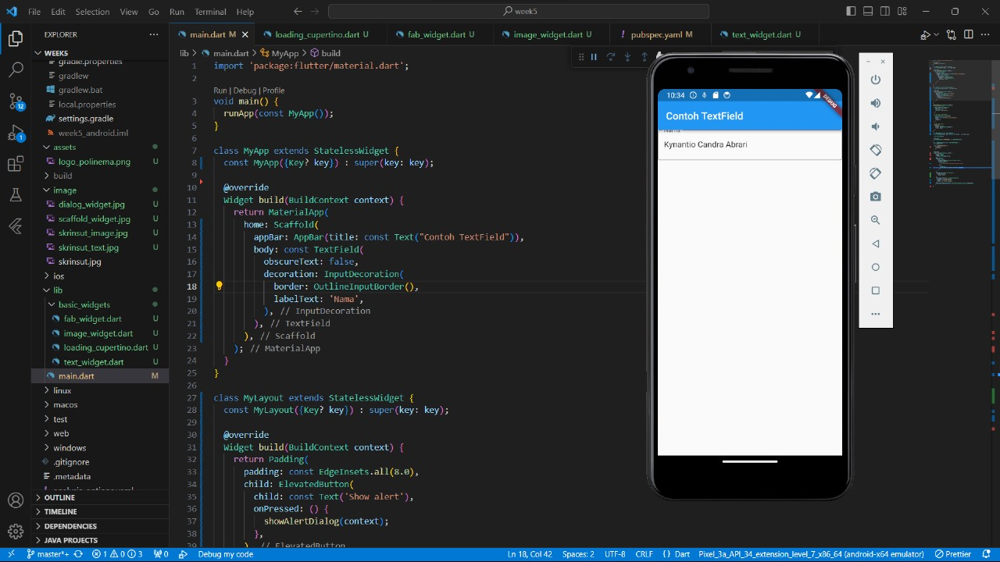

# week5

A new Flutter project.

## Getting Started

Screenshoot Hello World

Screenshoot Text Widget

Screenshoot Image Widget

Screenshoot Cuppertino Button and Loading Bar

Screenshoot Floating Action Button

Screenshoot Scaffold Widget

Screenshoot Dialog Widget

Screenshoot Input and Selection Widget

Screenshoot Date and Time Pickers
